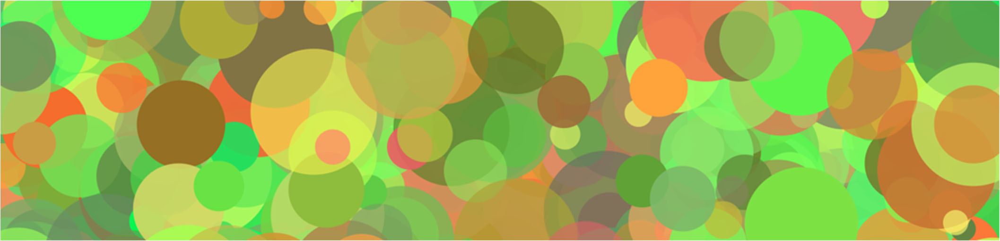

# SENG 265 Assignment 4

#### This assignment

**Instructions**
Assignment 4 consists of three (3) separate Python projects. The idea is to develop the famous SENG 265
Python Arts program incrementally. All three parts are required. The first two parts are worth 20% each and Part
3 is worth 60%. Store the three different Python projects in three subdirectories called a41, a42, a43 of the a4
directory.

**Part 1**
In Part 1 you are to develop an object‐oriented Python project that features a Circle class and generates an
HTML‐SVG file as depicted in Figure 1 below. Viewing this file in a web browser will render the SVG drawing
depicted in Figure 2 below. Start Part 1 by downloading this sample Python program (cf. Figure 1) and modify this
program as follows. Create classes for the geometric objects (i.e., Circle, Rectangle) as well as a class called
ProEpiloge to generate the HTML/SVG prologue and epilogue. The class names Circle, Rectangle, and
ProEpilogue are required for Part 1 for automated grading. Part 1 must generate some circles and rectangles.
Please note that there are no random numbers required for Part 1.

**Part 2**
 2 generates random numbers using a class called GenRandom (cf. Table 1) for generating random art using
an art range configuration class called ArtConfig (cf. Figure 3) that can be instantiated to create different art
types such as the images depicted in Figure 3 below. The output of Part 2 must be a table of random numbers as
depicted in Table 1 below. Please note that not all columns are required for Part 3 but are required for Part 2.
Also note that the random numbers you generate will of course be different than the numbers in Table 1.
However, the random numbers should be within the ranges specified in Table 2 below. The numbers should be
arranged in nicely aligned (right‐justified) columns. There are no requirements with respect to white space. The
class names GenRandom and ArtConfig are required for Part 2 for automated grading.

**Part 3**
The goal of Part 3 is to integrate the classes developed for Parts 1 and 2 into a third Python project and
generate some beautiful greeting cards for your friends and family in the form of HTML‐SVG pages. That is,
Projects 1 and 2 are test programs for the various classes required for Part 3. Instantiate three configuration class
objects to generate different art types as depicted in Figure 3 below. Image titles and captions are optional. All
the class names required for Parts 1 and 2 are required for Part 3.

